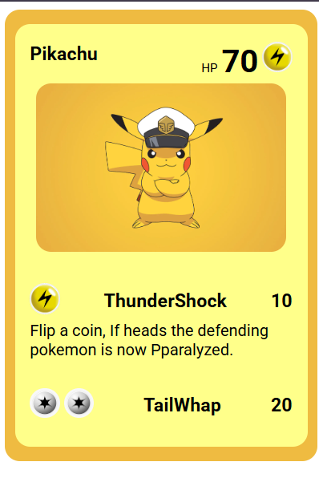

# Pokémon Card – Pikachu

This project is a simple HTML and CSS-based replica of a Pokémon card, featuring Pikachu. It demonstrates the use of basic layout techniques, image styling, flexbox, and hover effects.

## Preview

## Features

- Clean, card-style layout
- Flexbox alignment for structured content
- Rounded corners and shadow effect on image hover
- Organized component sections: title, stats, image, and description

## Technologies Used

- HTML5  
- CSS

## How to Run

1. Clone or download the repository  
2. Open `index.html` in any modern browser  
3. No additional setup is required  

